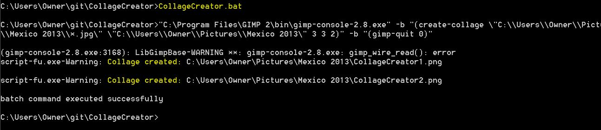

CollageCreator
==============

CollageCreator uses scripting to automate the process of creating a collage. It is a plugin for the [GIMP](http://www.gimp.org/) Image Manipulation program written in the Scheme functional programming language.

To create collages:  
1. Download [GIMP](http://www.gimp.org/downloads/).  
2. Place create-collage.scm into the default folder for GIMP scripts (Ex. "C:\\Program Files\\GIMP 2\\share\\gimp\\2.0\\scripts").  
3. Update the parameters to the create-collage function in CollageCreator.bat and then run it.  

Usage:  
create-collage files-in out-path num-rows num-cols num-collages

files-in = the input pictures  
out-path = directory where collages will be saved  
num-rows = number of rows in the collage  
num-cols = number of columns in the collage   
num-collages = number of collages to create

Example to create 2 3x3 collages of pictures from a trip to Mexico:  
create-collage \\"C:\\\Users\\\Mike\\\Pictures\\\Mexico\\\\*.jpg\\" \\"C:\\\Users\\\Mike\\\Pictures\\\Mexico\\\\\" 3 3 2
 

## Sample 2x2 Collage:

 

## Sample 3x3 Collage:

 

## Command Line Output:

